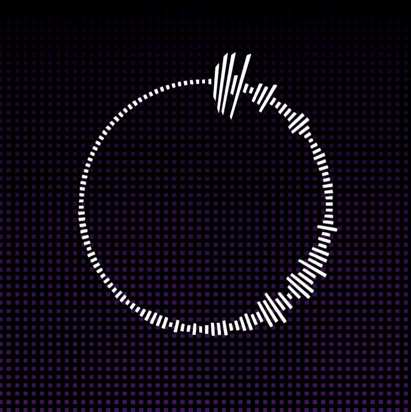

# MusicVisualization

### 效果演示

随着音乐，环带波动，背景渐变，进入高潮时，会进行UV偏移

### 技术选型

- 对声音采样后，以数组形式传递到Shader中
- 基于ShaderToy绘制圆环
  - UV得到弧度，弧度得到ID，对音强数组进行采样
  - 对音强求和，当达到阈值时，UV偏移
  - 通过UV取模+xy相乘得到点阵，绘制背景

### 运行环境

- Unity 2021.3.8f1，URP

### 其他

音乐来自网络，仅供学习
